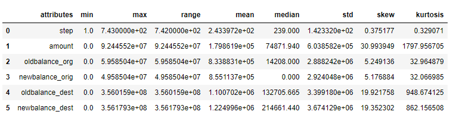
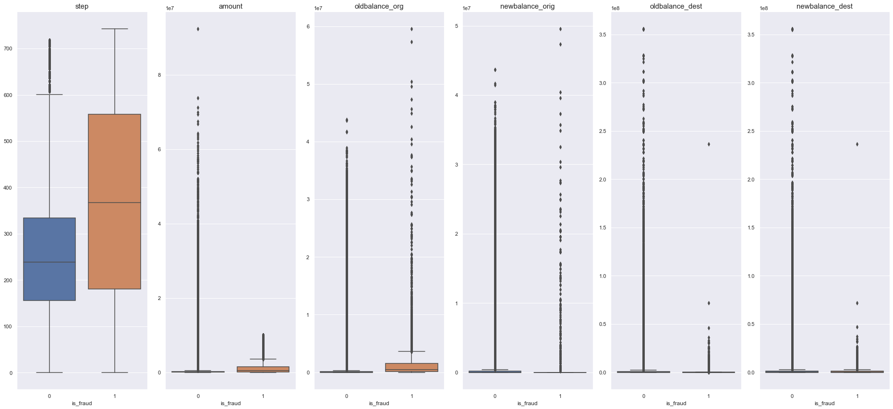
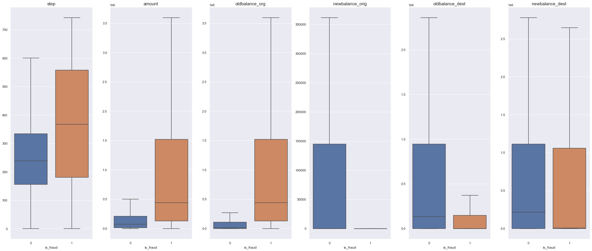
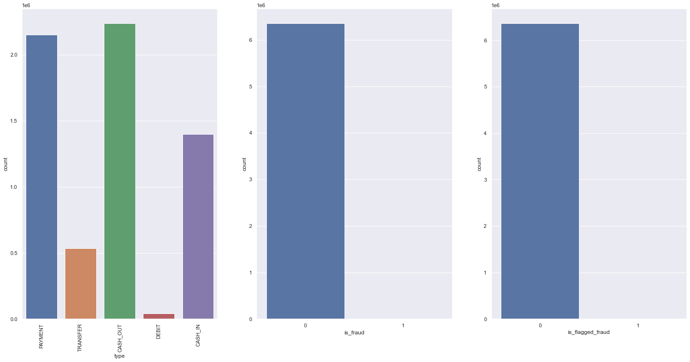
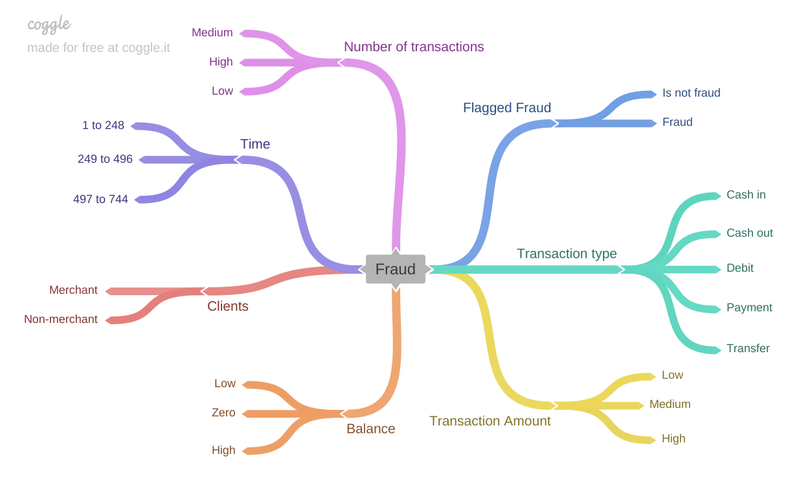

# Blocker Fraud Company
> in development 

> #First development cycle completed

## 1.0 The Problem

> The company and the context are fictitious.

This fraud classification project uses data from a synthetic dataset generated by the PaySim mobile money simulator. The dataset is publicly available in [Kaggle](https://www.kaggle.com/ntnu-testimon/paysim1).

Blocker Fraud Company is a company specialized in detecting fraud in financial transactions made through mobile devices. The company has a service called “Blocker Fraud” in which it guarantees the blocking of fraudulent transactions.

The company's business model is of the service type with the monetization made by the performance of the service provided, that is, the user pays a fixed fee on the success in detecting fraud in the client's transactions.

However, the Blocker Fraud Company is expanding in Brazil and to acquire customers more quickly, it has adopted a very aggressive strategy. The strategy works as follows:

1 - The company receives 25% of each transaction value truly detected as fraud.

2 - The company gives back 5% of each transaction value detected as fraud, however the transaction is legitimate.

3 - The company gives back 100% of the value for the customer in each transaction detected as legitimate, however the transaction is actually a fraud.

Questions:

- What is the model's Precision and Accuracy?
- How reliable is the model in classifying transactions as legitimate or fraudulent?
- What is the expected billing by the company if we classify 100% of transactions with the model?

## 2.0 The solution

Perform data analysis and create a machine learning model that maximizes the number of correct classifications

## 3.0 Solution Steps

The notebook is structured as:

- 1. Data description
- 2. Feature Engineering
- 3. Variable filtering
- 4. Exploratory data analysis
- 5. Data preparation
- 6. Feature Selection
- 7. Balancing Data
- 8. Machine Learning Modelling
- 9. Hyperparameter fine tuning
- 10. Translation and interpretation of the error

Below are some points of the project.

### 3.1 Data description

## Numerical

Key points:

- The median of the attributes "oldbalance_org", "newbalance_org", "oldbalance_dest", "newbalance_dest" and "amount" has a very different value in relation to the range, which indicates a large number of outliers (which can also be seen in boxplots).

- There are a lot of outliers in the dataset. We have two alternatives, or we leave outliers, since they can be just fraudulent transactions, or we can treat them and use a cleaner dataset. For this first cycle of the project I will make the first alternative.

## Categorical

- It is possible to see that data is highly unbalanced. Only 8213 out of 6362620 are frauds (0.1291 %) 

### 3.2 Hypothesis Map

This map helped to decide wich one of the variables were necessary to validate the hypothesis.

### Hypotesis validation - bivariate analysis

#### Hypothesis summary

| Hypotesis | Conclusion | Relevance | |
| ------ | ------ | ------ | ------ |
| H1 | True | High | Transaction that has Fraud flagged is always a fraud. |
| H2 | False | High | Transfer transaction is more likely to be a fraud. |
| H3 | True | Medium | The higher the value of the transaction the greater the chance of being fraud. |
| H4 | True | High | Zero-value transactions are more likely to be fraud. |
| H5 | False | Medium | Transactions whose initial balance is zero is never a fraud. (balance that started the transaction) |
| H6 | True | High | Transactions whose final balance is zero are more likely to be a fraud. (balance that started the transaction) |
| H7 | False | Low | Transactions that differ between the old balance and the new balance are more likely to be fraudulent. |
| H8 | True | Low | Transactions made and received by non-merchants are more likely to be a fraud. |
| H9 | True | Low | Transactions made outside normal hours are more likely to be fraud. |
| H10 | False | Low | Transactions made on the first 15 days of the month are more likely to be a fraud. |

## 4 Next Steps
